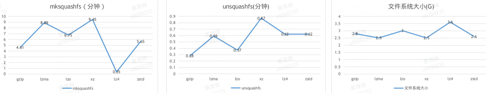

# iso builder

### Table of Contents

- [系统环境依赖](#系统环境依赖)
- [拉取基础环境](#拉取基础环境)
- [预装软件](#预装软件)
- [压缩文件系统](#压缩文件系统)
- [压缩ISO镜像](#压缩ISO镜像)

### 系统环境依赖

```shell
$ sudo apt install debootstrap apt-utils reprepro isolinux syslinux-common syslinux-efi librsvg2-bin xorriso dosfstools syslinux abigail-tools
```

### 拉取基础环境

```shell
$ sudo debootstrap --no-check-gpg --arch amd64 eagle chroot https://mirrors.tuna.tsinghua.edu.cn/debian/
```

### 预装软件

```shell
$ sudo chroot chroot/       #使用chroot命令切换到上一步获取的chroot环境内
$ apt install sl···         #切换到chroot内部后执行apt install 预装软件包
```

### 压缩文件系统

```shell
$ sudo mksquashfs chroot filesystem.squashfs  -comp xz
```

压缩参数性能比较：

|              |   gzip|   lzma|    lzo|     xz|    lz4|   zstd|
|--------------|-------|-------|-------|-------|-------|-------|
|      压缩后体积|   2.8G|   2.5G|     3G|   2.5G|   3.6G|   2.6G|
| mksquashfs时间|  4m36s|  8m53s|  6m45s|  9m27s|    21s|  5m39s|
| unsquashfs时间|    16s|    35s|    22s|    52s|    37s|    37s|



不同压缩等级对zstd参数的影响:

| zstd -Xcompression-level |      1|      8|     15|     22|
|--------------------------|-------|-------|-------|-------|
|                  压缩后体积|     3G|   2.7G|   2.6G|   2.6G|
|             mksquashfs时间|  1m30s|  1m33s|   6m4s|  22m3s|
|             unsquashfs时间|    21s|    20s|    23s|    20s|

不同压缩等级对gzip参数的影响:

| gzip -Xcompression-level |      1|      3|      6|      9|
|--------------------------|-------|-------|-------|-------|
|                  压缩后体积|     3G|   2.9G|   2.8G|   2.8G|
|             mksquashfs时间|  1m30s|  1m30s|  1m54s|  4m21s|
|             unsquashfs时间|    22s|    44s|    46s|    45s|

不同压缩页大小对xz参数的影响:

| xz -Xdict-size |    32K|    16K|     8K|
|----------------|-------|-------|-------|
|        压缩后体积|   2.5G|   2.6G|   2.6G|
|   mksquashfs时间|   9m1s|  8m41s|  8m26s|
|   unsquashfs时间|    57s|     1m|   1m1s|

### 压缩ISO镜像

amd64架构

```shell
xorriso -as mkisofs -V "UOS 20"  -o ../uniontechos-desktop-20-professional-amd64.iso -no-pad -isohybrid-mbr /usr/lib/ISOLINUX/isohdpfx.bin -c isolinux/boot.cat -b isolinux/isolinux.bin -no-emul-boot -boot-load-size 4 -boot-info-table -eltorito-alt-boot -e boot/efi.img -no-emul-boot -append_partition 2 0x01 boot/efi.img -isohybrid-gpt-basdat -isohybrid-apm-hfsplus .
```

arm64架构

```shell
xorriso -as mkisofs -r -J -c boot.cat -boot-load-size 4 -boot-info-table -eltorito-alt-boot --efi-boot boot/grub/efi.img -no-emul-boot -V "uos 20" -file_name_limit 250 -o  ../uniontechos-desktop-20-professional-arm64.iso .
```

mips64el架构

```shell
xorriso -as mkisofs -V "UOS 20" -R -r -J -joliet-long -l -cache-inodes -appid "UOS 20" -publisher "UOS <http://www.uniontech.com>" -V "UOS 20"  -o ../uniontechos-desktop-20-professional-mips64el.iso .
```

loongarch64架构

```shell
xorriso -as mkisofs -no-pad -full-iso9660-filenames -volid "UOS" -eltorito-catalog boot.catalog -eltorito-alt-boot -no-emul-boot -boot-load-size 4 -boot-info-table -isohybrid-gpt-basdat -isohybrid-apm-hfsplus -o ../uniontechos-desktop-20-professional-loongarch64.iso .
```


